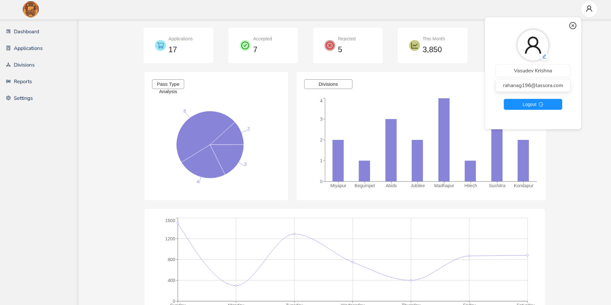
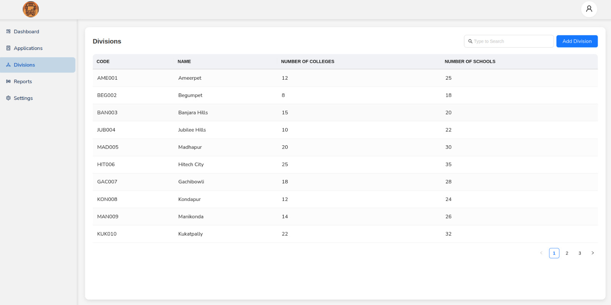
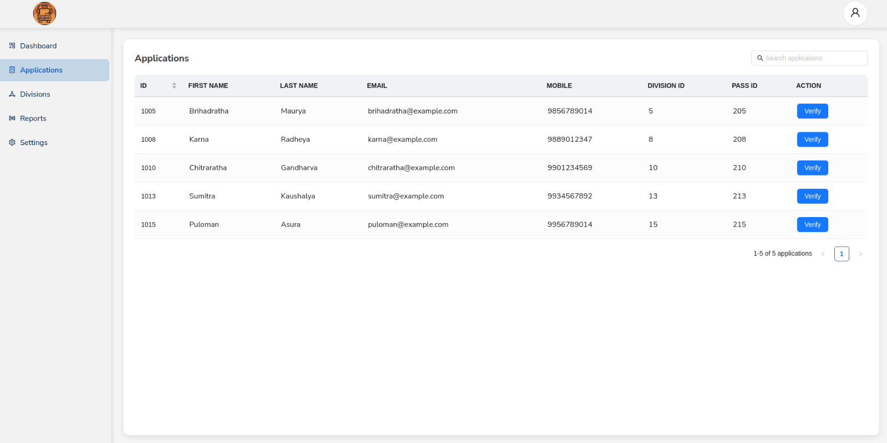
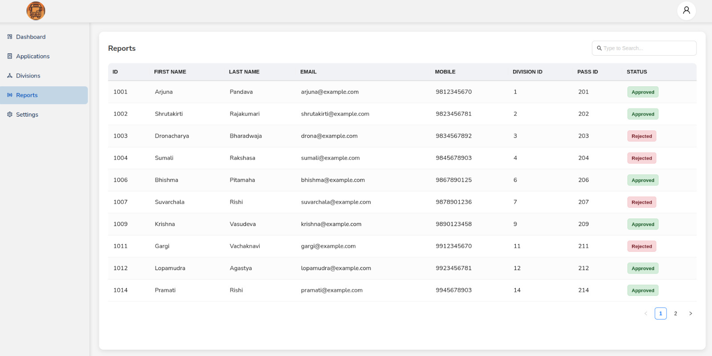

# UrbanAccess Admin Portal

  

  <h3>Frontend</h3>
  
  
  
  

  <h3>Backend</h3>
  
  
  

## 🏙️ About The Project

UrbanAccess Admin Portal is a comprehensive administration system for managing urban access passes for students in educational institutions. The platform enables administrators to verify applications, manage users, track divisions, and generate reports for urban transportation access passes.

## ✨ Live Demo

  

  

## 📸 Screenshots

  
  

  
  

## 🚀 Features

- **Comprehensive Dashboard**: Visual analytics and statistics for applications, approvals, and rejections
- **Application Management**: Review and process student applications for urban access passes
- **User Management**: Manage administrators and their access levels
- **Division Management**: Organize and track different urban divisions
- **Reporting**: Generate and view reports on pass usage and distribution
- **Authentication**: Secure login and registration system
- **Responsive Design**: Works seamlessly on desktop and tablet devices
- **Data Visualization**: Interactive charts and graphs using Recharts

## 📱 Pages

### Dashboard

- Overview of application statistics
- Pass type distribution analytics
- Division-wise application distribution
- Weekly revenue tracking

### Applications

- List of pending applications
- Search and filter functionality
- Quick access to application verification

### Verify Application

- Side-by-side comparison of submitted and original details
- Approve or reject applications with reason
- Confirmation modals for actions

### User Management

- List of administrators
- Add, edit, or remove admin users
- Assign divisions and permissions

### Divisions

- Manage urban divisions
- View colleges and schools in each division
- Track pass distribution by division

### Reports

- Generate custom reports
- Export data in various formats
- Visualize trends and patterns

## 🛠️ Built With

### Frontend

- [React](https://reactjs.org/) - Frontend library
- [TypeScript](https://www.typescriptlang.org/) - Type safety
- [Vite](https://vitejs.dev/) - Build tool and development server
- [Ant Design](https://ant.design/) - UI component library
- [Recharts](https://recharts.org/) - Charting library for data visualization
- [React Router](https://reactrouter.com/) - Navigation and routing
- [Axios](https://axios-http.com/) - HTTP client

### Backend

- [Spring Boot](https://spring.io/projects/spring-boot) - Java-based framework
- [Java](https://www.java.com/) - Programming language
- [PostgreSQL](https://www.postgresql.org/) - Relational database
